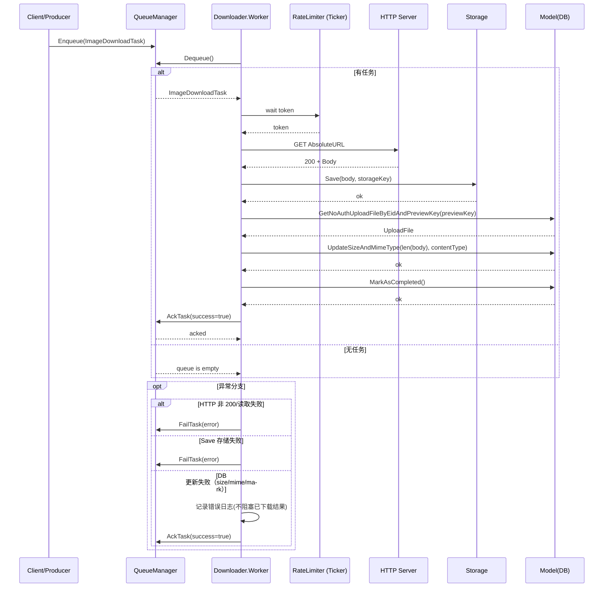

# 图片资源服务 (Image Asset Service)

## 功能概述

图片资源服务用于处理文档转换后 Markdown 内容中的 `/static/` 图片链接，将其下载到本地存储并替换为预览链接。

## 主要特性

- ✅ 独立队列: 使用独立的 Redis 队列，避免与现有 docconv 队列冲突
- ✅ 限流控制: 20张/秒的下载限流，避免性能冲击
- ✅ 重试机制: 失败任务最多重试 3 次，使用指数退避策略
- ✅ 批次管理: 所有图片处理完成后统一更新 FileBody 内容
- ✅ 幂等安全: 支持重复触发，不会错误替换已转换的链接
- ✅ 状态跟踪: 完整的 UploadFile 状态管理和错误记录

## 工作流程

1. 触发: 文档转换完成后，在保存 FileBody 时自动触发
2. 解析: 扫描 Markdown 内容，提取 `/static/` 图片链接
3. 创建: 为每张图片创建 UploadFile 记录（Status=pending）
4. 映射: 构建 staticPath -> previewURL 的映射关系
5. 入队: 将下载任务推送到独立队列
6. 下载: Worker 池按限流处理下载任务
7. 更新: 下载成功后更新 UploadFile 状态和存储
8. 替换: 所有任务完成后，统一替换 FileBody 内容

## 配置要求

### 环境变量
- `DOC_CONVERT_BASE_URL`: 文档转换服务的基础 URL（如: http://192.168.1.218:5022）
- `REDIS_ENABLED`: 必须为 true（队列依赖 Redis）

### 服务配置
- Worker 数量: 4 个并发 worker
- 限流速率: 20 张/秒
- 重试次数: 最多 3 次
- 重试间隔: 300ms, 1s, 3s（指数退避）

## 文件结构

```
service/image_asset/
├── types.go              # 数据结构定义
├── queue.go              # Redis 队列管理
├── orchestrator.go       # 编排器（解析、替换）
├── downloader.go         # 下载器（限流、重试）
├── service.go            # 服务封装
├── orchestrator_test.go  # 单元测试
└── README.md             # 文档说明
```

## API 接口

### 公开函数

- `InitImageAssetService()`: 初始化服务
- `StartImageDownloadWorkers(ctx, workerCount, rateLimit)`: 启动下载工作器
- `StartImageReplacementAsync(eid, fileID, userID, fileBodyID, content)`: 异步处理图片替换

### 内部组件

- `QueueManager`: Redis 队列管理器
- `Orchestrator`: 内容解析和替换编排器
- `Downloader`: 图片下载和存储处理器

## 监控和日志

### 关键日志
- 图片扫描结果统计
- 队列入队和出队操作
- 下载成功/失败记录
- 重试和状态更新
- 批次完成统计

### 状态跟踪
- UploadFile.Status: pending -> completed/failed
- UploadFile.Error: 失败原因记录
- Redis 队列长度和 pending 计数

## 错误处理

### 下载失败
- 最多重试 3 次
- 失败后标记 UploadFile.Status = failed
- 记录详细错误信息到 UploadFile.Error
- 不阻塞其他图片的处理

### 预览访问
- 图片下载完成前，/api/preview/{key} 返回 404（可接受）
- 下载完成后正常返回图片内容

## 测试

### 单元测试
```bash
go test ./service/image_asset/... -v
```

### 功能验证
```bash
go run test_image_service.go
```

## 使用示例

### 输入内容
```markdown

[文档链接](/static/20250829/uuid/doc.pdf)

```

### 输出内容
```markdown

[文档链接](http://192.168.1.218:9002/api/preview/def456.pdf)

```

## 注意事项

1. Redis 依赖: 服务依赖 Redis，如果 Redis 不可用会跳过处理
2. 存储空间: 下载的图片会占用本地存储空间
3. 网络访问: 需要能够访问 DOC_CONVERT_BASE_URL 指定的服务
4. 并发控制: 全局限流确保不会对源服务造成压力
5. 幂等性: 重复触发不会产生副作用，但会增加处理开销

---

## 架构图

```mermaid
graph LR
  C[Producer/触发者] -->|Enqueue| Q[QueueManager<br/>Redis 队列]
  Q -->|Dequeue| W[Downloader.Worker]
  W -->|限流等待| RL[RateLimiter<br/>(Ticker)]
  W -->|HTTP GET 图片| H[HTTP Server]
  H -->|200 + Body| W
  W -->|Save(body, key)| S[storage.StorageInstance]
  W -->|By PreviewKey 获取| M[model.UploadFile]
  W -->|UpdateSizeAndMimeType| DB[(DB)]
  W -->|MarkAsCompleted| DB
  W -->|AckTask| Q

  %% 异常路径（注释说明）
  classDef error fill:#fdd,stroke:#f99,color:#900;
  E1[HTTP 错误/超时]:::error
  E2[存储失败]:::error
  E3[DB 更新失败]:::error

  W -.-> E1
  W -.-> E2
  W -.-> E3
```

## 时序图



## 实现细节/注意事项（补充）

- size 计算来源：完整读取响应体后使用 `len(body)`，并以 `int64(len(body))` 传递。
- 元信息持久化：通过 `uploadFile.UpdateSizeAndMimeType(size, contentType)` 将 size 和（当不为空时）MimeType 写入数据库；`MarkAsCompleted()` 仅更新状态与处理时间。
- 容错策略：若 DB 更新失败，记录错误日志但不影响已下载的文件存储；任务仍可被 Ack，避免阻塞后续处理。
- 排障建议：
  - 对照下载日志 “(... bytes)” 与数据库中的 `size` 是否一致。
  - 当 `Content-Type` 为空时，不覆盖已有 `MimeType`；非空则更新。
  - 若发现 `size=0`，优先检查模型层是否正确调用 `UpdateSizeAndMimeType`，以及数据库更新是否成功。